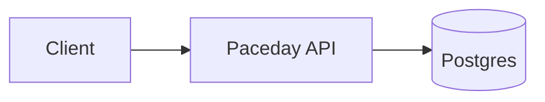

# Architecture — Paceday (web)

## Overview

<One paragraph: what this service does, who calls it, who it depends on.>

## System diagram

## Services

| Name | Port | Depends on | Notes |
|---|---|---|---|
| api | 8080 | db | HTTP |
| db | 5432 | — | Postgres 16 |

## Data stores

- **db (Postgres)** — durable; backups via pg_dump nightly (TBD).

## Deployment shape

`docker compose up` from repo root brings the full stack up. Production uses the same compose file with `docker-compose.prod.yml` overrides.

## Cross-cutting

- Logging: JSON to stdout
- Health: `/healthz` (liveness), `/readyz` (readiness)
- Metrics: `/metrics` (Prometheus)
- Tracing: OpenTelemetry, OTLP exporter
