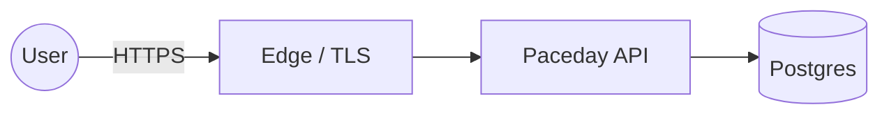

# Security — Paceday (web)

## Assets

| Asset | Sensitivity | Notes |
|---|---|---|
| User accounts | High | PII; subject to local privacy law |
| Session tokens | High | short TTL, rotated |
| Application data | Medium | per-user scoped |

## Trust boundaries

## Threats (STRIDE)

| Boundary | Threat | Mitigation |
|---|---|---|
| User → Edge | Spoofing | TLS + auth |
| Edge → API | Tampering | mTLS or signed JWT |
| API → DB | Information disclosure | least-priv DB user, parameterized queries |
| Anywhere | DoS | rate limit at edge |

## Out of scope

- Physical security of self-hosted runners (assumed trusted environment).

## Review cadence

Updated on every architectural change; re-reviewed quarterly by `security-engineer`.
